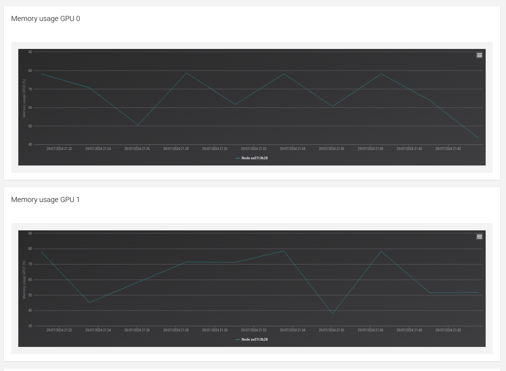

# Training with model parallelism via FSDP
## Background
For background on model parallelism, FSDP and related technologies, see [slides](slides.pdf). We also recommend the blog [Everything about Distributed Training and Efficient Finetuning](https://sumanthrh.com/post/distributed-and-efficient-finetuning/) for a more comprehensive overview over these subjects.

## Example
***NOTE***: This demo is only meant to illustrate a simple and transparent training run with FSDP, and should not be used as a deep-learning training script. We intentionally omit common features such as model checkpoints, evaluation, etc.
Most pytorch training libraries support FSDP out-of-the-box, e.g., see the docs for [huggingface accelerate](https://huggingface.co/docs/accelerate/usage_guides/fsdp), [pytorch lightning](https://lightning.ai/docs/pytorch/stable/api/lightning.pytorch.strategies.FSDPStrategy.html), [mosaic composer](https://docs.mosaicml.com/projects/composer/en/stable/notes/distributed_training.html#fullyshardeddataparallel-fsdp).

We are fine-tuning a [CodeLlama-7b](https://huggingface.co/codellama/CodeLlama-7b-hf) model on a dataset of [chess moves](https://huggingface.co/datasets/laion/strategic_game_chess) (in text notation). Full fine-tuning of all 7b parameters results in more parameters than fit on a single 80GB A100 GPU. We therefore use [Fully Sharded Data Parallel (FSDP)](https://pytorch.org/tutorials/intermediate/FSDP_tutorial.html) to shard the model parameters on each device.
1. Install a conda environment with the most recent version of [PyTorch](https://pytorch.org/) (with CUDA) and huggingface transformers (`pip install transformers`). Activate the environment. See the directions on the Research Computing [PyTorch webpage](https://researchcomputing.princeton.edu/support/knowledge-base/pytorch).
2. On the Research Computing clusters, the compute nodes with GPUs are not connected to the internet. We therefore have to download the models manually first and cache them to our local directory. You can achieve this by running: `python download_models.py`
3. Look at `chess_finetune.py` and see how FSDP wrapping works. We implement special logic to define the FSDP units by layer.
4. Submit `chess_finetune.sh` to Slurm. This script requires 4 A100 GPUs by default.

### DDP vs. FSDP
Distributed data parallel (DDP) means that GPUs perform forward and backward pass on different examples in parallel, and gradients are exchanged between the GPUs before each optimization step. This means the total batch size is `batch_size_per_device * num_gpus`.
Fully-sharded data parallel (FSDP) still runs data parallelism, but in addition also shards the model parameters, and exchanges them between GPUs when necessary for a certain computation.

**Question:** Could the example training work on a single GPU? See what happens with a without model parallelism by adding the `--no_fsdp` flag and setting the `--batch_size_per_device` to 1.

### Tuning FSDP
We will see how FSDP can be tuned further. By sharding model parameters, we free up a lot of GPU memory, which can allow us to run with batch sizes larger than 1.

There are two different notions of batch size:
1. `batch_size_per_device` is the number of sequences that are processed in one pass per device. *You should always try to maximize this batch size for optimal GPU utilization and throughput.*
2. The other notion of batch size is from an optimization point of view, i.e. how many sequences to use per gradient update step. This can be a multiple of `batch_size_per_device` by using gradient accumulation, which sums the gradients without updating the parameters. Therefore, the total batch size for optimization is `batch_size_per_device * num_gpus * gradient_accumulation_steps`. Our script sets `gradient_accumulation_steps` to keep the total batch size constant. Therefore, we can change the number of GPUs and tune the `batch_size_per_device` without changing the optimization. Fixing the total batch size means that we won't have to tune the learning rate and other hyperparameters again.

**Question:** What is the maximum possible batch size per device when training with FSDP? Increase `BATCH_SIZE_PER_DEVICE` by factors of 2 and re-run `chess_finetune.sh`. How does the time per gradient step change as you increase the batch size per device?

**Question:** Try adding gradient checkpointing via `--gradient_checkpointing`. How fast is training without changing batch size? What happens if you further increase the batch size?

## Checking GPU utilization

There are three ways to check the GPU Utilization when your jon is running

### Using `bsc_load`

```bash
[{username}alogin1 04_model_parallel_with_fsdp]$ bsc_load {slurm_jobid}
╭───────────┬─────────┬─────────────────┬──────────────────┬─────────────────┬─────────────────┬─────────────┬────────────┬────────────┬────────┬────────┬─────────┬────────┬────────┬────────╮
│ NODE      │   NCPUs │   CPU_USAGE (%) │   AVAIL_MEM (MB) │   FREE_MEM (MB) │   MEM_USAGE (%) │ POWER (W)   │   GPU0 (%) │   MEM0 (%) │   GPU1 │   MEM1 │    GPU2 │   MEM2 │   GPU3 │   MEM3 │
├───────────┼─────────┼─────────────────┼──────────────────┼─────────────────┼─────────────────┼─────────────┼────────────┼────────────┼────────┼────────┼─────────┼────────┼────────┼────────┤
│ as07r3b28 │      80 │           7.938 │           515560 │          456569 │          11.442 │ N/A         │     56.000 │     78.168 │ 99.000 │ 78.327 │ 100.000 │ 78.591 │ 74.000 │ 76.071 │
╰───────────┴─────────┴─────────────────┴──────────────────┴─────────────────┴─────────────────┴─────────────┴────────────┴────────────┴────────┴────────┴─────────┴────────┴────────┴────────╯

```
Here you can see that GPU 0 is used for 56%, GPU 1 for 99%, GPU 2 for 100% and GPU 3 for 74%.

### By loging in to the compute node

Get the name of your compute node with `squeue` and then log in to that node.

```bash
[{username}@alogin1 04_model_parallel_with_fsdp]$ squeue
    JOBID           PARTITION   NAME        USER        ST  TIME    NODES   NODELIST(REASON)
    {slurm_jobid}   acc         {job_name}  {username}  R   9:35    1       {compute_node}
[{username}@alogin1 04_model_parallel_with_fsdp]$ ssh {compute_node}
Warning: Permanently added '{compute_node}' (ED25519) to the list of known hosts.
load bsc/1.0 (PATH, MANPATH)
[{username}@{compute_node} ~]$ nvidia-smi
Mon Jul 29 21:26:12 2024       
+---------------------------------------------------------------------------------------+
| NVIDIA-SMI 535.86.10              Driver Version: 535.86.10    CUDA Version: 12.2     |
|-----------------------------------------+----------------------+----------------------+
| GPU  Name                 Persistence-M | Bus-Id        Disp.A | Volatile Uncorr. ECC |
| Fan  Temp   Perf          Pwr:Usage/Cap |         Memory-Usage | GPU-Util  Compute M. |
|                                         |                      |               MIG M. |
|=========================================+======================+======================|
|   0  NVIDIA H100                    On  | 00000000:1B:00.0 Off |                    0 |
| N/A   45C    P0             286W / 700W |  45934MiB / 65247MiB |    100%      Default |
|                                         |                      |             Disabled |
+-----------------------------------------+----------------------+----------------------+
|   1  NVIDIA H100                    On  | 00000000:2C:00.0 Off |                    0 |
| N/A   45C    P0             272W / 700W |  45974MiB / 65247MiB |     49%      Default |
|                                         |                      |             Disabled |
+-----------------------------------------+----------------------+----------------------+
|   2  NVIDIA H100                    On  | 00000000:9D:00.0 Off |                    0 |
| N/A   45C    P0             281W / 700W |  45482MiB / 65247MiB |     95%      Default |
|                                         |                      |             Disabled |
+-----------------------------------------+----------------------+----------------------+
|   3  NVIDIA H100                    On  | 00000000:AD:00.0 Off |                    0 |
| N/A   44C    P0             271W / 700W |  40390MiB / 65247MiB |     38%      Default |
|                                         |                      |             Disabled |
+-----------------------------------------+----------------------+----------------------+
                                                                                         
+---------------------------------------------------------------------------------------+
| Processes:                                                                            |
|  GPU   GI   CI        PID   Type   Process name                            GPU Memory |
|        ID   ID                                                             Usage      |
|=======================================================================================|
|    0   N/A  N/A    384631      C   /opt/conda/bin/python                     43476MiB |
|    1   N/A  N/A    384632      C   /opt/conda/bin/python                     42376MiB |
|    2   N/A  N/A    384633      C   /opt/conda/bin/python                     44096MiB |
|    3   N/A  N/A    384634      C   /opt/conda/bin/python                     39176MiB |
+---------------------------------------------------------------------------------------+
```

### By using the userportal

Go to [userportal.bsc.es](https://userportal.bsc.es/) and search for your Slurm job ID. Click on `VIEW` to see graphs of your GPU utilization.


